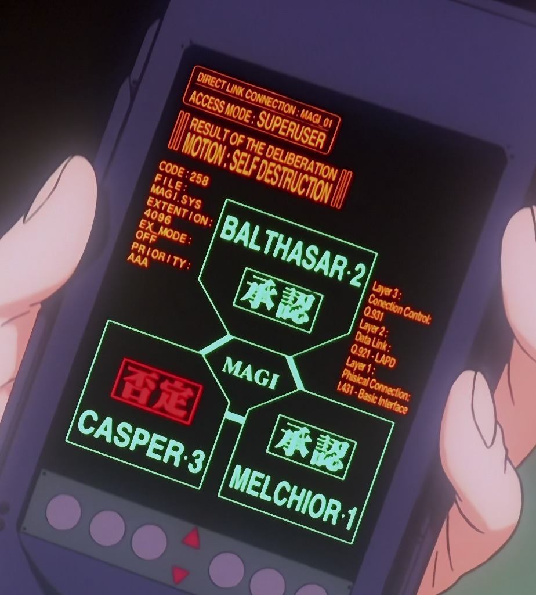

# MAGI CRT Decision Console

一个以 MAGI 决策系统为主题的前后端项目。当前已实现 React/Vite 前端模拟应用；`backend/` 仍是待开发工作区，`docs/openapi.yaml` 是未来真实后端的唯一 REST 契约。



## 启动

仅在本机预览时，从仓库根目录执行：

```bash
npm install
npm run dev
```

根目录的 npm 脚本会转发到 `frontend/` 工作区。Vite 会输出本地访问地址，通常是 `http://localhost:5173`。如果该端口已被占用，以终端实际显示的端口为准。

### 手机与局域网预览

让同一 Wi-Fi 下的手机或其他设备访问时，Vite 必须监听所有网卡：

```bash
npm run dev -- --host 0.0.0.0 --port 5174
```

终端会输出类似下面的地址。手机应访问 `Network` 地址，而不是 `localhost`：

```text
Local:   http://localhost:5174/
Network: http://192.168.x.x:5174/
```

macOS 上可以用 `ipconfig getifaddr en0` 查看当前 Wi-Fi IPv4 地址。`127.0.0.1` 只代表本机回环；如果 Vite 只监听 `127.0.0.1:5173`，手机无法通过局域网访问。

仍然无法访问时，依次检查：

- Mac 与手机是否连接同一 Wi-Fi，且不是开启设备隔离的访客网络。
- 「系统设置 → 隐私与安全性 → 本地网络」是否允许运行 Vite 的终端或 Codex。
- macOS 防火墙是否允许 Node.js 的入站连接。
- VPN/代理是否开启了「拦截局域网」；必要时启用「允许局域网」或暂时关闭代理。
- 访问地址使用 `http://`，并且端口与 Vite 终端输出一致。

## 运行模式

默认不需要任何后端：

```bash
VITE_API_MODE=mock
```

接入后端时，在 `.env.local` 中设置：

```bash
VITE_API_MODE=remote
VITE_API_BASE_URL=http://localhost:8000
```

若远程服务不可访问，界面会自动切回本地模拟器，并在顶栏显示降级连接状态。

当前 `remote` 适配只覆盖已有 `DecisionService` 的系统状态、Agent、创建、执行和轮询路由。节点配置、三 Agent 完整输出与历史页面仍由前端模拟，不代表 OpenAI 兼容服务、本地模型或任何真实供应商已经接通。

## 开机动画与主页模式

访问主页会先播放 CRT 电源开机、POST 系统自检和 MAGI 人格连接动画，最后停在 `SELECT DISPLAY MODE` 供用户选择：

- `ORIGINAL / DIRECT LINK`：进入尽量还原原作构图的 MAGI Direct Link 界面。
- `MODERN / DECISION HOME`：进入可输入议题、执行三人格判定和查看历史的现代化主页。

桌面端使用上/下方向键切换高亮，按 Enter 确认；鼠标也可点击选中行。主要输入设备为粗指针且不支持悬停时，页面会显示手机用的 `CONFIRM ...` 命令：先点击选项，再点击确认，避免误触直接跳转。

按 Esc 或点击底部 `BYPASS AUTO-IPL` 只会快进到模式选择，不会直接进入主页。确认后才会进行显示驱动交接、短促黑场和主页显示。启动完成状态与所选主页模式都保存在当前标签页的 `sessionStorage` 中；URL 加 `?boot=replay` 可强制重播。当系统启用“减少动态效果”时，会直接进入模式选择。

NERV 标志动画与 MAGI 几何启动动画已拆分为可复用组件，可通过以下独立页面预览：

- `http://localhost:5173/nerv-logo-anime-test.html`
- `http://localhost:5173/magi-boot-test.html`（支持点击、Enter 或空格键重播）
- `http://localhost:5173/magi-direct-link-test.html`（原作风格直连页独立预览）

旧版 `DecisionConsole` 不再作为主页，保留在 `http://localhost:5173/decision-console-lab.html`，用于组件与视觉实验。

## 当前网页产品流

- 开机结束后先选择原作风格直连页或现代决策主页；所选模式在当前标签页中保持。
- 现代模式 `#/`：输入一个问题，选择优先级和模拟场景，观察三个 MAGI 人格逐票形成裁定。
- 点击任一节点：打开该 Agent 的配置弹窗。连接方式、BASE URL、MODEL、角色 Prompt 与 API Key 当前只影响前端模拟状态。
- `#/history`：读取当前浏览器 `localStorage` 中最多 30 条模拟判定历史。
- `#/history/:id`：显示最终裁定、三票及三个 Agent 的完整用户可见模拟答复。

安全边界：API Key 只保存在当前 React 页面运行时内存，不写入 `localStorage`、历史、日志或公开配置。所谓“完整输出”是结论、理由、风险和建议，不是隐藏 chain-of-thought。

## 模拟场景

- `STANDARD`：两票承认，一票否决。
- `REJECT PATH`：两票否决，一票承认。
- `REVIEW PATH`：承认、否决、弃权各一票，结果进入人工复核。

## 项目结构

```text
backend/                       后端预留工作区与框架无关端口骨架
docs/                          API 规范、接口说明与设计验证记录
frontend/                      React/Vite 前端应用
frontend/src/app/              前端入口、根组件与全局样式
frontend/src/domain/           前端领域模型与 API 数据类型
frontend/src/domain/home-mode.ts       两套主页模式与会话级保存
frontend/src/features/         开机动画、决策控制台和 MAGI 几何测试页
frontend/src/features/decision-home/   当前主页、节点配置、hash 路由和前端模拟历史
frontend/src/features/decision-console/  旧三节点原语与独立实验页组件
frontend/src/features/magi-direct-link-test/  原作风格直连主页与独立预览入口
frontend/src/features/nerv-logo-anime/  可复用的 NERV 标志进场动画与独立测试入口
frontend/src/features/magi-boot/        可复用的 MAGI 几何启动动画与独立测试入口
frontend/src/labs/             独立组件实验页入口
frontend/src/services/         Mock、HTTP 与故障降级适配层
package.json                   根工作区脚本与项目级工具
```

## 验证

```bash
npm run test
npm run build
npm run lint:api
```

完整接口说明见 [docs/API.md](docs/API.md)，OpenAPI 文件见 [docs/openapi.yaml](docs/openapi.yaml)，后端从零开发、安全与联调步骤见 [docs/backend-guides.md](docs/backend-guides.md)，前端分层说明见 [docs/frontend-structure.md](docs/frontend-structure.md)。

预留后端契约覆盖节点配置、判定历史分页、事件和三个 Agent 的完整用户可见输出。`apiKey` 在契约中为 write-only，配置响应只返回 `credentialConfigured`；当前仓库并未实现这些远程路由。

## 许可证

本项目采用 **GNU AGPL-3.0-or-later** 单一许可：可以免费使用、修改及部署，但必须遵守 AGPL 的源码提供义务（含网络交互场景下向用户提供对应源代码）。

完整条款见仓库根目录的 [LICENSE](LICENSE) 或 [GNU AGPL-3.0 官方原文](https://www.gnu.org/licenses/agpl-3.0.html)。

## 二创声明

- 本项目是以《新世纪福音战士》（新世紀エヴァンゲリオン）中 MAGI 决策系统为主题的**非商业粉丝二次创作项目**，与 Khara 及任何相关权利方无关。
- 「新世纪福音战士」「エヴァンゲリオン」「MAGI」「NERV」等名称与相关素材的著作权、商标权归其原权利人所有；项目中由本项目作者编写的代码，其著作权归项目作者，并按上述 AGPL 许可发布。
- 本项目不用于任何商业用途。若权利人认为本项目内容不适当，请通过 [GitHub Issues](https://github.com/SEELE0/EVAMagi-AI/issues) 联系，确认后将及时处理。
