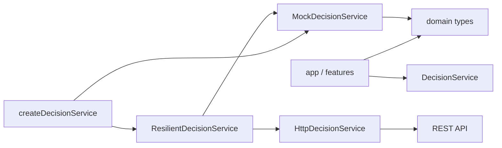

# 前端代码结构说明

本文档说明 `frontend/` 中的代码分层、运行入口、数据流和扩展约定。前端使用 React、TypeScript、Vite 和 Vitest，默认运行本地 Mock 决策服务。

## 目录总览

```text
frontend/
├── asset/                              原始图像资源
├── index.html                          主应用 HTML 入口
├── magi-boot-test.html                 MAGI 几何动画预览入口
├── magi-direct-link-test.html          原作风格直连页预览入口
├── nerv-logo-anime-test.html           NERV 标志动画预览入口
├── src/
│   ├── app/                              主应用组装与全局样式
│   ├── domain/                           跨界面、跨服务领域类型与主页模式
│   ├── features/
│   │   ├── bios-start/                  BIOS 自检动画组件与实验入口
│   │   ├── boot-intro/                  主页 CRT/POST 开机层
│   │   ├── decision-console/            保留的旧控制台组件与试验田
│   │   ├── decision-home/               当前主页、节点配置、历史与明细
│   │   ├── magi-boot/                   MAGI 几何启动组件与预览页
│   │   ├── magi-direct-link-test/       原作风格直连界面与预览页
│   │   └── nerv-logo-anime/             NERV 标志组件与预览页
│   ├── labs/                             旧控制台独立实验页入口
│   ├── services/                         决策服务接口、Mock、HTTP 与降级适配
│   └── vite-env.d.ts                    Vite 生成的类型声明
├── package.json                        前端依赖与命令
├── tsconfig*.json                      TypeScript 配置
└── vite.config.ts                      Vite/Vitest 及多页构建配置
```

`frontend/dist/` 和 `frontend/node_modules/` 分别是构建产物与第三方依赖，不属于需要手工维护的源码。

## 运行入口

### 主应用

`index.html` 加载 `src/app/main.tsx`，由 React 渲染 `App.tsx`。`App` 按以下顺序组装页面：

1. `BootIntro`：显示 CRT 电源开机、POST 自检、MAGI 几何加载与终端交接动画。主流程是 `power-on → post-header → magi → post-stream → mode-select → exit → resync → reveal`。Esc 与 BYPASS AUTO-IPL 只快进到 `mode-select`，不完成启动；用户确认 `original` 或 `modern` 后才写入 `sessionStorage`、执行显示驱动交接并露出主页。桌面端保留方向键/Enter；`(hover: none) and (pointer: coarse)` 输入设备显示两步触控确认。`?boot=replay` 可强制重播。排期常量集中导出为 `BOOT_SCHEDULE_MS`，阶段状态挂在 `data-boot-phase` 上，舞台按 `BOOT_STAGE_PRESETS` 等比缩放并记录在 `data-boot-layout`。
2. `App`：通过 `domain/home-mode.ts` 读写当前标签页的主页模式。`original` 渲染 `MagiDirectLinkTest`，`modern` 渲染 `DecisionHome`。开机层消失前，背景容器保持 `inert`，键盘焦点不会落入背景界面。

`BootIntro` 检测到 `prefers-reduced-motion: reduce` 时会直接进入模式选择，不会跳过选择进入主页。

### 独立预览页

Vite 配置了六个构建入口：

| 页面 | React 入口 | 用途 |
| --- | --- | --- |
| `index.html` | `src/app/main.tsx` | 完整应用 |
| `decision-console-lab.html` | `src/labs/decision-console/main.tsx` | 保留旧 `DecisionConsole` 的组件实验页 |
| `magi-boot-test.html` | `src/features/magi-boot/main.tsx` | 单独调试 MAGI 几何动画 |
| `magi-direct-link-test.html` | `src/features/magi-direct-link-test/main.tsx` | 单独预览原作风格 MAGI Direct Link 界面 |
| `nerv-logo-anime-test.html` | `src/features/nerv-logo-anime/main.tsx` | 单独调试 NERV 标志动画 |
| `bios-start-test.html` | `src/features/bios-start/BiosStart.tsx` | BIOS 自检动画的实验入口 |

预览页用于组件级视觉验证，不参与主应用的业务路由。`bios-start-test.html` 通过 `src/features/bios-start/main.tsx` 独立渲染，仍属于实验性入口；它与其他预览页一样拥有自己的 React `createRoot` 入口。

## 分层与依赖方向



依赖应从界面与功能层流向领域和服务层。服务层不应导入 React 组件，领域层不应依赖具体的 HTTP 或 Mock 实现。

## 领域层

`src/domain/decision.ts` 是前端的共享数据契约，定义：

- MAGI 节点、健康状态和投票值。
- 决策请求、决策状态和最终裁定。
- 系统连接状态与 Mock/Remote 来源。
- 决策事件和 API 错误结构。

增加或修改 API 字段时，先更新领域类型与 `docs/openapi.yaml`，再调整服务实现和界面。

## 服务层

### `DecisionService`

`src/services/decision-service.ts` 定义界面层唯一依赖的服务接口：

- 读取系统状态和 Agent 列表。
- 创建、读取和执行决策。
- 读取决策事件。

React 组件不直接调用 `fetch`，因此可以在不改动界面的情况下替换数据源。

### 实现与选择策略

| 文件 | 职责 |
| --- | --- |
| `mock-decision-service.ts` | 在内存中模拟完整决策过程，支持 standard/reject/review 场景 |
| `http-decision-service.ts` | 按 REST 契约请求远程后端，并将网络与 HTTP 错误转换为 `DecisionServiceError` |
| `resilient-decision-service.ts` | 远程网络不可达、超时或服务端暂时不可用时一次性切换至 Mock；参数、权限、资源和业务错误继续上抛 |
| `create-decision-service.ts` | 根据 Vite 环境变量组装正确的服务实例 |

运行模式：

```env
# 默认值，不依赖后端
VITE_API_MODE=mock

# 优先请求远程服务，失败后降级到 Mock
VITE_API_MODE=remote
VITE_API_BASE_URL=http://localhost:8000
```

## 当前模拟应用

`DecisionHome.tsx` 是 `modern` 模式的主容器：

- `#/` 只显示原 title 顶栏、复用的三节点判定舞台、问题/优先级/场景输入和紧凑裁定。
- 鼠标悬停、键盘聚焦或点击节点会显示可配置提示并打开 `AgentConfigDialog`。
- `#/history` 是历史列表；`#/history/:id` 展示一次判定中三个 Agent 的完整用户可见输出。
- 节点配置目前只在 React 页面内存中；API Key 不进入 localStorage，也不会发送网络请求。
- 历史目前按版本写入 localStorage，最多 30 条，包含公开配置元数据和模拟输出。

`DecisionSimulator.tsx` 直接复用 `decision-console/ConsolePrimitives.tsx` 的 `AgentNode`、旧 `magi-network` 几何、连线坐标和 `is-scanning` 动画。不要在主页复制或重写绿色三模块。

`decision-console/` 保持原实现，作为组件库试验田由 `/decision-console-lab.html` 单独打开。`ConsolePrimitives.tsx` 和 `console-config.ts` 同时是主页的复用来源。

## 动画组件

### `BiosStart`

显示橙色 CRT BIOS 硬件自检、三个 MAGI 节点上线与终端交接动画。组件已由 `features/bios-start/index.ts` 导出，但主应用并未挂载它，当前启动层使用 `BootIntro`。

### `NervLogoAnime`

通过 `size`、`fadeOut`、`className` 和 `style` 调整展示，默认在进场与停留后淡出。`index.ts` 是对外导出入口。

### `MagiBootTest` / `MagiBoot`

通过 SVG 绘制核心三角形、同心圆和三个人格分支。支持 `size`、`background`、`interactive`、`showCrtEffects`、`animationTimeScale`（整体缩放动画时长而不改变几何）、`className`、`style` 和 `onReplay`，点击或使用 Enter/空格键可重播。`MagiBoot` 是 `MagiBootTest` 的导出别名。

## 典型数据流

1. 用户可先点击节点，在页面内存中配置连接方式、Base URL、Model、API Key 和角色卡。
2. 用户选择模拟场景，输入议题与优先级，`DecisionSimulator` 调用 `DecisionService.createDecision`。
3. 界面获得 `decisionId` 后调用 `executeDecision`。
4. 执行期间每 220ms 调用 `getDecision`，旧 `is-scanning` 动画和逐票状态由领域对象驱动。
5. 完成后生成三个 Agent 的用户可见模拟输出并写入本地历史。
6. 历史路由读取列表或单条明细。Remote 模式下只有网络不可达、请求超时或 5xx/429 等可重试基础设施错误才会触发 `ResilientDecisionService` 切换至 Mock；业务错误不会被伪装成本地成功。

未来把配置和历史迁移到后端时，应先扩展 `DecisionService`，对应 `docs/openapi.yaml` 的 configuration、历史分页和 results 路由；React 组件不要直接调用 `fetch`。

## 测试与构建

本机启动与同局域网手机联调分别使用：

```bash
npm run dev
npm run dev -- --host 0.0.0.0 --port 5174
```

第二条命令会让 Vite 监听所有网卡；手机需访问终端输出的 `Network` 地址。如果只监听 `127.0.0.1`，局域网设备无法连接。

```bash
npm run test
npm run build
```

当前单元测试覆盖：

- Mock 服务的三种裁定路径。
- Remote 网络故障（含请求超时）时的一次性自动降级；后端业务错误如实上抛而不降级。
- HTTP 服务的请求超时与后端错误码映射。
- BootIntro 的阶段推进、跳过交互、会话标记与 reduced-motion 降级（jsdom + 假定时器），以及 BootScene 静态结构与其 CSS 约束。
- 新主页边界、节点配置、历史存储、完整模拟输出与窄屏 CSS 约束。
- NERV 标志和 MAGI 几何动画的静态结构渲染。
- BIOS 自检动画的关键文案与终端结构渲染。

新增服务实现时，应继续实现 `DecisionService` 接口，并在需要时传递 `AbortSignal` 以支持卸载和超时取消；新增独立视觉页时，需同时在 `vite.config.ts` 的 `build.rollupOptions.input` 中注册 HTML 入口。

## 源码许可标识

项目自行维护的 TypeScript/TSX 源码文件使用 `SPDX-License-Identifier: AGPL-3.0-or-later` 文件头。第三方依赖、构建产物和自动生成文件不应添加项目版权声明。
