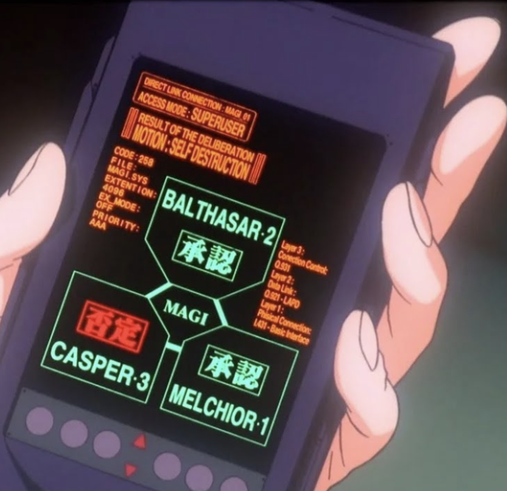

# MAGI「直连合议终端」UI/UX 改版计划

> 文档状态：设计方案，尚未实施。
>
> 本方案只描述 decision-home 的首页交互与视觉改版，不修改现有 React、CSS、服务层或共享组件。

## 设计解读（从截图提炼 → 移植到主页判定台）

截图表现的不是普通首页，而是 MAGI 已进入高权限合议状态后的终端画面。因此改版不应把截图做成一个静态三栏看板，而应把它设计成当前主页内部的一次状态变换：

```text
第一页待机：MAGI 主体已经展示但是不是画面主体 主题是用户输入框，但是此时已经可以通过点击节点进行设置
        ↓ 用户在主体上方方输入议题
同页转场：输入区收缩，MAGI 主体移入中心并放大
        ↓
合议终端：直连信息、人格投票、动议与结果逐步出现
```

核心 UX 模式：

- 主体先行：第一页就展示三人格 MAGI 网络，不把核心视觉藏到第二页。
- 输入紧邻主体：议题输入框位于 MAGI 网络上方，用户立即理解“要让这个系统审议什么”。
- 同页变换：执行后不跳转到另一张页面，而是让现有 处在下方的MAGI 网络从待机尺寸移动到中心并放大。
- 票面内联：投票状态长在 MELCHIOR-1、BALTHASAR-2、CASPER-3 节点上。
- 终端参数密度：放大后的状态补充截图式 key-value 信息，营造直连系统的真实感。
- 严格颜色语义：绿色 = 承認 / 正常，红色 = 否定 / 阻断，黄色 = 保留 / 等待，橙色 = 系统命令。
- 动议与结论分离：MOTION 表示用户提交的议题；FINAL VERDICT 表示 MAGI 最终判定，不能把 MOTION 直接写成“承認 / 否决”。

视觉沿用项目已有的橙色 CRT 语言（#FF6A02 / #FFAD3E 系、黑底、扫描线和等宽终端文字），移植截图的布局关系、状态密度和决策语义；不把 SELF DESTRUCTION 当成所有议题的固定品牌文案。

## 参考图



图中橙红色终端命令、绿色承認节点、红色否定节点和中央 MAGI 合议结构，是本方案的主要视觉参考。图片作为仓库内文档资源保存，不依赖临时剪贴板路径。

## 当前实现基线

当前主页由 App → BootIntro → DecisionHome → DecisionSimulator 组成。DecisionSimulator 已有以下可复用基础：

- magi-network：三人格节点、中央 MAGI、三条连接线。
- NodeConfigHotspots：点击人格节点打开配置。
- magi-home__input-dock：议题、优先度、场景和执行按钮。
- magi-home__compact-verdict：当前底部紧凑判定条，后续可被放大状态的 MotionBanner 替换或复用。
- isExecuting：当前执行中状态，并驱动 magi-network is-scanning。
- pollTimer：当前决策状态轮询实现；本方案不假设当前分支已经存在 AbortController 或 poll-decision。

本次方案的主要调整对象是：

- frontend/src/features/decision-home/DecisionSimulator.tsx
- frontend/src/features/decision-home/decision-home.css
- frontend/src/features/decision-home/DecisionHome.test.tsx
- frontend/src/features/decision-home/decision-home-css.test.ts

decision-console 共享原语、履历页、AgentConfigDialog 和服务层不在本次视觉方案的改造范围内。

## 目标布局（DecisionSimulator 区域）

### A. 初始状态：主体已展示，输入位于主体下方

```text
topbar（NERV 品牌 + readouts，保留）
navigation（系统状态 + 判定 / 履歴，保留）


├──────────────────────────────────────────────┤
│ 判定議題                                      │
│ ┌──────────────────────────────────────────┐ │
│ │ 一つの議題（問い）を入力してください…       │ │
│ └──────────────────────────────────────────┘ │
│ 优先度        场景               [判定开始]  │
└──────────────────────────────────────────────┘
│                                              │
│                 MAGI / STANDBY               │
│                                              │
│            BALTHASAR-2                       │
│                 ╲                            │
│ CASPER-3 ─────── MAGI ─────── MELCHIOR-1    │
│                                              │
│          THREE SYSTEMS READY                 │
│                                              │
```

初始状态要求：

- MAGI 网络位于主要视觉区域，不能被 telemetry 或日志挤到边缘。
- 网络使用待机色：低亮绿色线框、低强度光晕、节点状态为 待機。
- 输入框直接位于网络下方，成为唯一主要操作。
- 优先度和场景保留现有功能，但视觉权重低于议题输入和执行按钮。
- 不在初始状态显示大号 RESULT OF THE DELIBERATION，避免用户误以为尚未提交的议题已有结论。

### B. 输入后 / 执行中：同页变换为直连合议终端

```text
topbar（保留）
navigation（保留）

┌──────────────────────────────────────────────┐
│ DIRECT LINK CONNECTION: MAGI 01              │
│ ACCESS MODE: SUPERUSER                       │
├──────────────────────────────────────────────┤
│ RESULT OF THE DELIBERATION                    │
│ MOTION: [用户提交的议题]                       │
├─────────────┬────────────────────┬───────────┤
│ SYSTEM      │                    │ LAYER     │
│ CODE        │                    │ LAYER-01  │
│ FILE        │    放大后的 MAGI    │ BALTHASAR │
│ EXEC MODE   │   三人格合议网络     │ 承認       │
│ PRIORITY    │                    │ LAYER-02  │
│             │                    │ ……        │
├─────────────┴────────────────────┴───────────┤
│ 议题摘要 / 优先度 / 场景                 ●   │
└──────────────────────────────────────────────┘
```

状态变换要求：

- 输入 dock 收缩为顶部或底部的议题摘要，不丢失用户刚刚提交的内容。
- magi-network 从待机位置向中央移动，并放大为合议主视觉。
- 终端 link-strip、motion-banner、左右参数栈在网络放大过程中分阶段显现。
- 三个节点依次从 待機 → 接続中 → 承認 / 否定 / 棄権 变化。
- 执行中保留扫描线运动；完成后停止连续扫描，只保留最终结果的短暂确认光。

### C. 完成状态：结果突出，但主体不消失

```text
RESULT OF THE DELIBERATION
MOTION: [用户提交的议题]

                 MAGI

         CONSENSUS: 02 / 03
         FINAL VERDICT: 承認
```

完成状态不应把 MAGI 网络替换成单独的大字结果卡。主体继续位于中心，最终判定叠加在终端信息层中，保证“系统作出结论”的叙事关系仍然可见。

## 设计元素映射（截图 → 实现）

| 截图元素                        | 规划组件                       | 数据与规则                                                                         |
| ------------------------------- | ------------------------------ | ---------------------------------------------------------------------------------- |
| DIRECT LINK CONNECTION: MAGI 01 | magi-home__link-strip          | 由系统协议和连接态组成；连接异常时显示对应错误语义。                               |
| ACCESS MODE: SUPERUSER          | magi-home__link-strip 内第二行 | 作为 MAGI 高权限审议的界面语义；不代表向用户暴露真实 API 权限。                    |
| RESULT OF THE DELIBERATION      | magi-home__motion-banner       | 仅在提交后、执行中和完成状态出现；待机状态隐藏。                                   |
| MOTION: SELF DESTRUCTION        | magi-home__motion-banner       | MOTION 使用 decision.subject；只有议题本身为自毁时才显示 SELF DESTRUCTION。        |
| 三个人格节点                    | 现有 magi-network / AgentNode  | 保留现有节点位置、投票状态和配置热点。                                             |
| 绿色承認 / 红色否定             | AgentNode 的 vote 状态         | 使用现有 approve / reject / abstain / pending 数据，不用静态装饰色覆盖真实状态。   |
| CODE                            | magi-home__system-stack        | 使用 decision.id 的短码展示；完整 ID 仍可在详情或履历中查看。                      |
| FILE                            | magi-home__system-stack        | MAGI.SYS 作为系统身份标签，属于稳定的产品文案。                                    |
| EXEC MODE                       | magi-home__system-stack        | 待机 IDLE、提交后 EXEC、完成后 HOLD；与真实 UI 阶段对应。                          |
| PRIORITY                        | magi-home__system-stack        | 由现有 low / normal / critical 映射为 A / AA / AAA，同时保留用户可读的中文优先度。 |
| 右侧 LAYER 信息栈               | magi-home__layer-stack         | 镜像三人格的 id、投票、health 和 latency；必须与中央节点状态一致。                 |
| 底部圆形执行键                  | 现有 magi-home__execute        | 桌面端为圆形终端按钮；执行中禁用并显示进度；窄屏退化为全宽矩形。                   |

## 交互与动画规格

### 状态机

```text
STANDBY
  ├─ 用户输入 → INPUT_READY
  └─ 点击执行 → SUBMITTING

SUBMITTING
  └─ 创建决策成功 → DELIBERATION

DELIBERATION
  ├─ 轮询中 → 三人格依次点亮 / 连接线扫描
  ├─ 完成 → FINAL_VERDICT
  └─ 失败 → ERROR

FINAL_VERDICT
  └─ 新议题 → STANDBY 或保留当前结果并重新输入
```

### 推荐动效节奏

| 阶段     | 动作                                      | 建议节奏          |
| -------- | ----------------------------------------- | ----------------- |
| 收起输入 | 输入区高度缩短，议题转为摘要              | 180–240ms        |
| 主体移动 | MAGI 网络从待机位置移动到中央             | 320–480ms        |
| 主体放大 | 网络与中央核心同步放大                    | 320–480ms        |
| 终端显现 | link-strip、motion-banner、参数栈逐层出现 | 80–160ms stagger |
| 投票审议 | 三个节点按固定顺序接入                    | 每节点 220–360ms |
| 结果确认 | 中央 MAGI 短暂增强光晕，结果文本稳定      | 240–360ms        |

动画不能只依赖颜色变化表达投票结果；节点必须同时拥有可读文字、aria-live 状态和稳定布局。

### 动议、投票、结论的文案层级

```text
MOTION: 用户提交的议题

MELCHIOR-1: 承認
BALTHASAR-2: 承認
CASPER-3: 否定

FINAL VERDICT: 承認 / 否定 / 要再審
```

MOTION 不是 verdict 的别名。这样既保持截图的终端语法，也避免把用户的问题改写成系统结果。

## 视觉 tokens

### 色彩

| Token           | 值      | 用途                                   |
| --------------- | ------- | -------------------------------------- |
| --home-void     | #050706 | 主终端背景                             |
| --home-terminal | #0B100D | 终端面板与参数栈                       |
| --home-shell    | #211D2D | 截图式紫灰设备外壳感，可作为局部框体色 |
| --home-sodium   | #FFAD42 | 系统命令、按钮、重点标签               |
| --home-phosphor | #8CFFBD | 正常连接、承認、MAGI 节点              |
| --home-alert    | #FF584D | 否定、异常、危险动议                   |
| --home-review   | #F1D35C | 要再審、保留、等待                     |

### 字体与信息密度

- 终端参数：优先使用等宽字体，保证 CODE / FILE / PRIORITY 的垂直对齐。
- MAGI 节点标题：使用当前项目已有的标题字体体系，不在本次文档中假设新的授权字体已存在。
- 大写英文标签可以使用较窄的无衬线或等宽字体，避免过度装饰。
- 参数栈字号建议 10–11px，结果和节点状态字号必须明显大于参数文字。
- 中文状态词不能只依赖英文字母缩写，至少同时显示 承認 / 否定 / 要再審。

## 响应式策略

### 桌面端（≥ 1021px）

- MAGI 网络作为中央主视觉。
- system-stack 位于左侧，layer-stack 位于右侧。
- 执行按钮可以使用 76–84px 圆形按钮。
- 输入 dock 在待机状态完整显示；执行后压缩成议题摘要。

### 中等宽度（761–1020px）

- 左右参数栈缩窄，但不覆盖三节点。
- 圆形执行按钮保留，输入字段允许换行。
- 如三栏空间不足，layer-stack 可移动到网络下方，system-stack 保留关键字段。

### 移动端（≤ 760px）

- 初始状态顺序：MAGI 主体 → 议题输入 → 优先度 / 场景 → 执行按钮。
- 执行后主体仍然居中放大，但参数栈改为上下堆叠。
- 圆形执行按钮退化为全宽矩形，保证触控区域至少 44px 高。
- 输入摘要固定在顶部或主体下方，不允许内容消失。

### 窄屏（≤ 390px）

- 所有参数栈改为两列 key-value 行，不使用固定宽度。
- 三人格节点保持完整可读，连接线不能侵入文字区域。
- 页面不产生水平滚动。
- prefers-reduced-motion 下跳过移动和放大动画，直接进入对应状态。

## 实施步骤

### 1. 设计文档

- 新建本文件作为 UI/UX 规格。
- 以本文件的 STANDBY → DELIBERATION → FINAL_VERDICT 状态作为实现依据。

### 2. DecisionSimulator.tsx 改造建议

- 新增纯展示子组件：LinkStrip、MotionBanner、SystemStack、LayerStack。
- 使用可派生的页面阶段 class 或 data-phase，区分 standby、submitting、deliberation、final、error。
- 保留 magi-network、AgentNode、NodeConfigHotspots 和现有服务调用逻辑。
- 将当前 magi-home__compact-verdict 的内容重新组织到放大状态的 MotionBanner，但保留可访问的最终判定文本。
- motion 使用 subject，verdict 单独显示，不能混用。
- 当前分支的 pollTimer 不在本次设计文档阶段改写为其他轮询协议。

### 3. decision-home.css 样式改造建议

- 待机状态采用“网络主视觉 + 输入 dock”两段式布局。
- 执行状态通过阶段 class 让网络移动、放大，并展开终端信息层。
- deliberation-grid 只在提交后成为三栏布局，避免初始首页变成监控看板。
- motion-banner 使用 verdict 语义色：approved 绿、rejected 红、review 黄、pending 暗橙。
- 执行按钮桌面端使用圆形按钮，≤760px 退回全宽矩形。
- 保留当前 1020px、760px、480px、390px 响应式断点，并重新检查状态变换后的布局。

### 4. 测试更新建议

DecisionHome.test.tsx：

- 初始 DOM 同时包含 magi-network 和议题输入。
- 初始状态不显示 RESULT OF THE DELIBERATION。
- 执行状态显示 DIRECT LINK CONNECTION、ACCESS MODE、MOTION。
- MOTION 断言使用当前议题文本，不能断言为固定 SELF DESTRUCTION。
- 三人格节点、配置热点和现有 vote 状态断言保持通过。

decision-home-css.test.ts：

- 待机布局包含网络与输入 dock 的顺序约束。
- 执行阶段包含主体 transform / scale 的样式规则。
- motion-banner 包含 approved / rejected / review 三种颜色语义。
- 圆形执行按钮、移动端矩形回退和 reduced-motion 规则存在。

### 5. 视觉 QA

实施后再在 docs/design-qa.md 追加记录，至少覆盖：

- 桌面待机状态；
- 桌面执行中状态；
- approved / rejected / review 三种结果；
- 390×844 移动端待机和执行中状态；
- 无水平溢出、无节点遮挡、无浏览器 console 警告；
- reduced-motion 下可以直接到达稳定状态。

## 不做的事

- 不修改 AgentNode、Readout、ConsolePrimitives.tsx 等共享原语。
- 不修改 decision-console 试验田的实现。
- 不修改服务层、API 合同或当前轮询机制。
- 不修改 topbar、navigation、履历页和 AgentConfigDialog 的业务职责。
- 不把第一页改成只有输入框、完全隐藏 MAGI 主体。
- 不把截图中的 SELF DESTRUCTION 固定为所有议题的首页文案。
- 不使用静态假 telemetry 代替真实 Agent 状态。
- 不让扫描线、噪点或发光效果压过议题、投票和最终判定。

## 验证

本阶段只生成设计文档，未执行代码修改、测试或视觉回归。

实施阶段建议执行：

```bash
cd frontend && npm test
```

必要时启动开发服务器，目检以下状态：

1. 初始页面：主体可见，输入框位于主体下方。
2. 输入后：主体移动并放大，输入内容没有消失。
3. 执行中：直连信息、三人格投票和扫描动画按顺序出现。
4. 完成后：主体保持居中，MOTION、投票和 FINAL VERDICT 信息层级清晰。
5. 移动端：无横向滚动、节点不遮挡文字、按钮可触控。

## 方案结论

首页的核心不是“输入页”或“结果页”二选一，而是一个可变形的 MAGI 终端：

```text
MAGI 主体先出现
        ↓
输入议题
        ↓
MAGI 主体居中放大
        ↓
模拟原作截图的直连合议过程
        ↓
保留主体并显示最终判定
```
